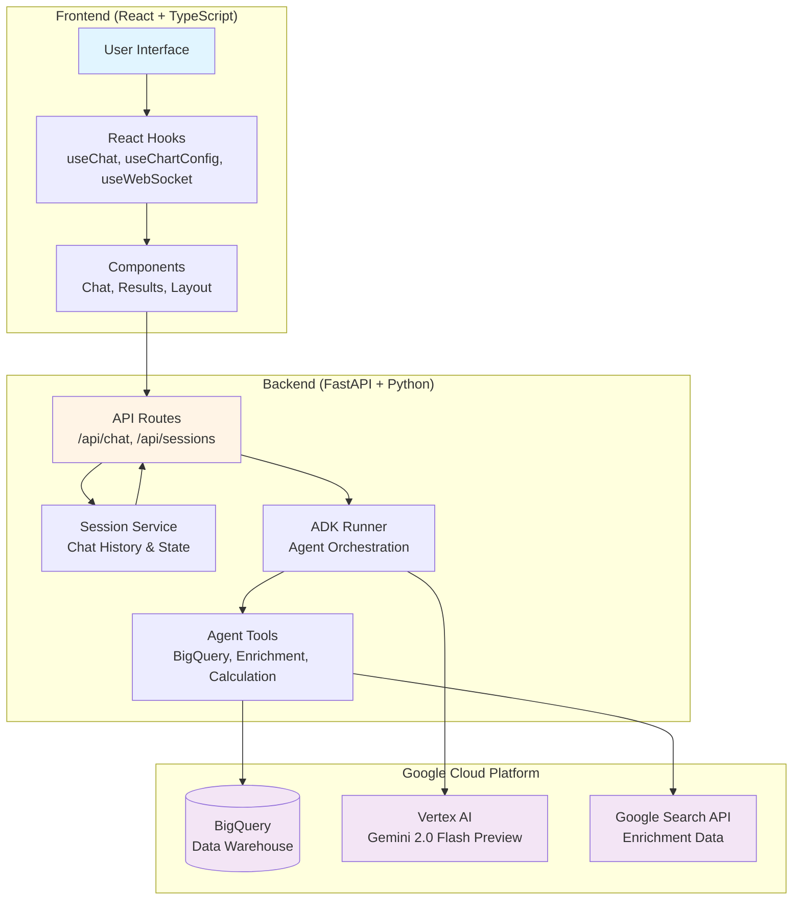
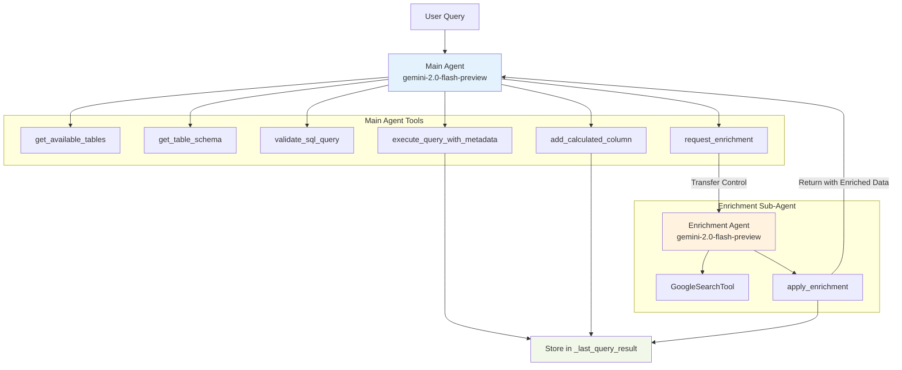
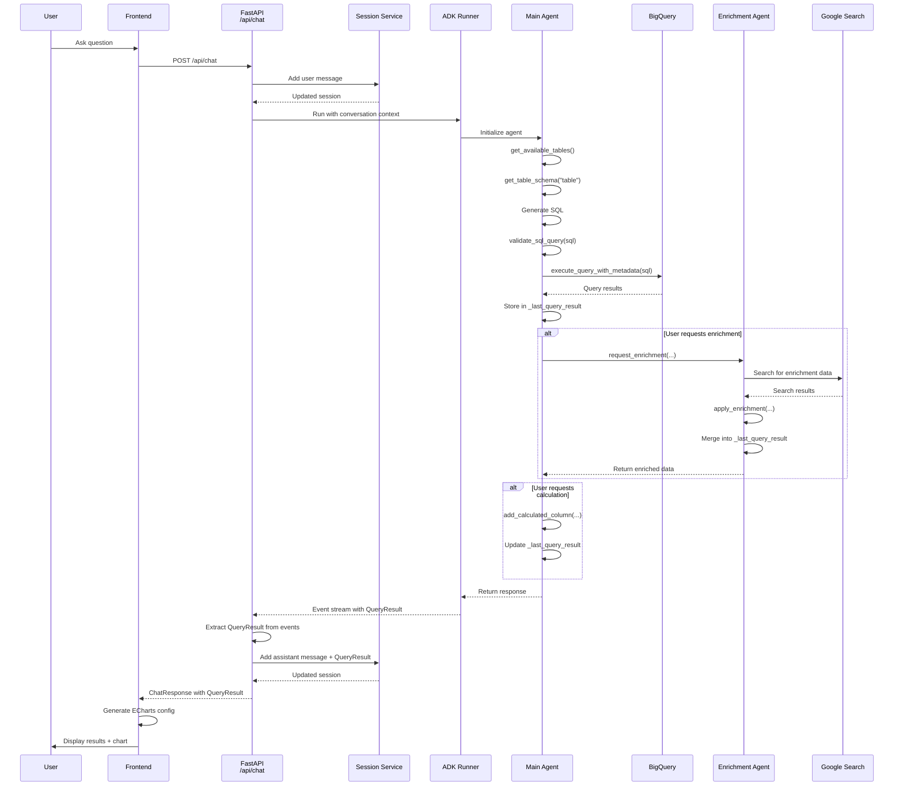
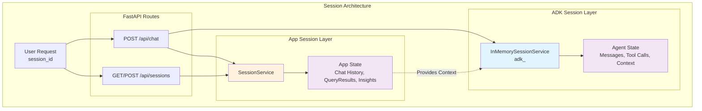
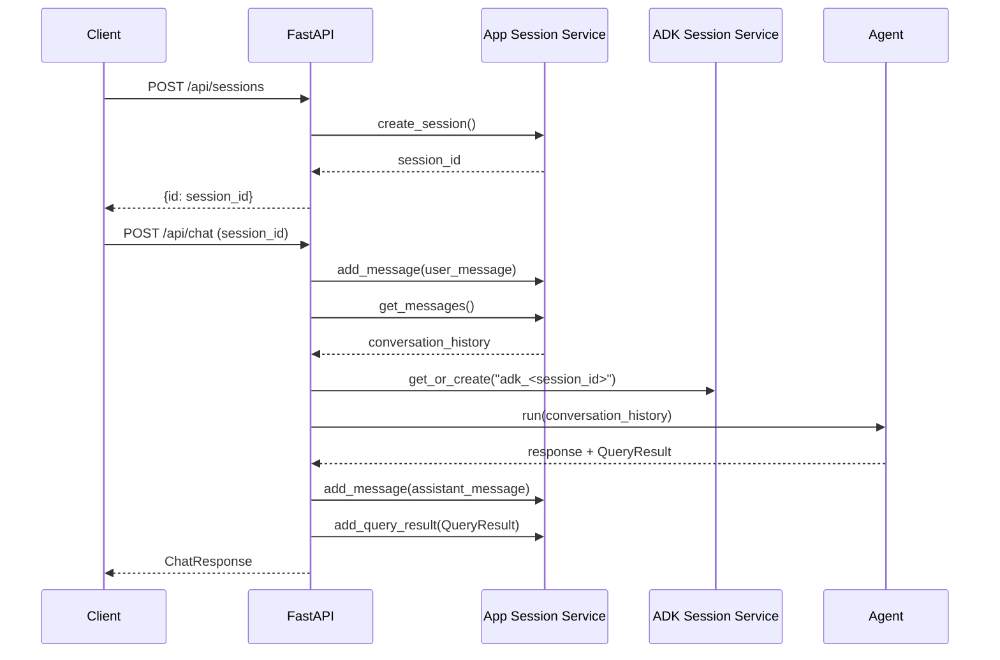
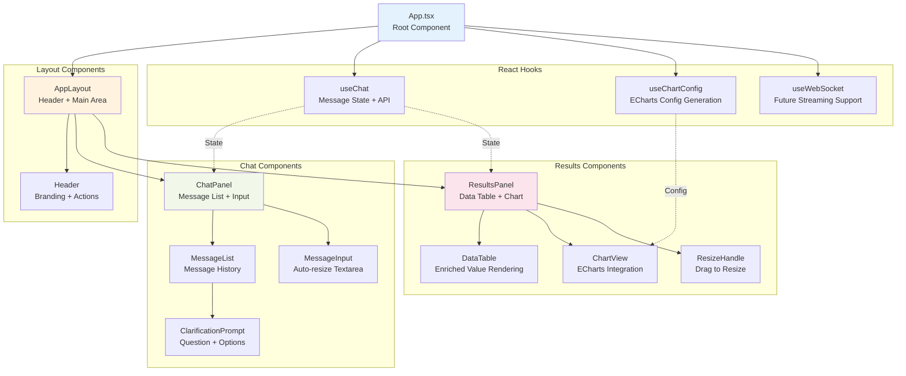
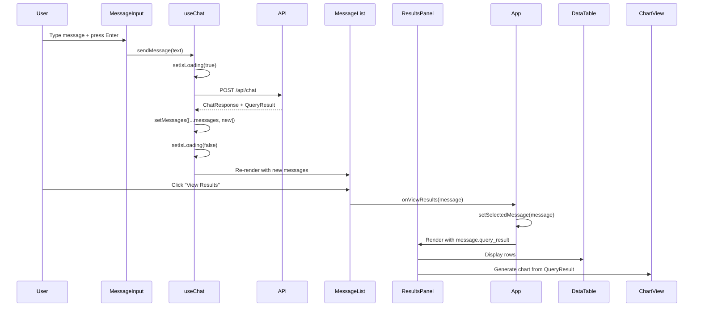

# System Architecture

This document provides a comprehensive overview of the Data Insights Agent architecture, including system components, agent workflows, data flows, and session management.

## Table of Contents

1. [High-Level Architecture](#high-level-architecture)
2. [Agent System Architecture](#agent-system-architecture)
3. [Data Flow](#data-flow)
4. [Session Management](#session-management)
5. [Frontend Component Hierarchy](#frontend-component-hierarchy)

---

## High-Level Architecture

The Data Insights Agent is built with a three-tier architecture: React frontend, FastAPI backend, and Google Cloud Platform services.



### Key Technologies

- **Frontend**: React 18, TypeScript, Vite, TailwindCSS, Apache ECharts
- **Backend**: FastAPI, Python 3.11+, Google ADK (Agent Development Kit)
- **AI/ML**: Google Gemini 2.0 Flash Preview via Vertex AI
- **Data**: BigQuery for data warehousing, Google Search for enrichment
- **State**: In-memory session service (ADK + custom app sessions)

---

## Agent System Architecture

The application uses a **two-agent architecture** with the main agent orchestrating queries and delegating enrichment to a specialized sub-agent.



### Agent Workflow

1. **Main Agent** receives user query and conversation context
2. Main agent uses schema tools (`get_available_tables`, `get_table_schema`) to understand available data
3. Main agent generates SQL and executes via `execute_query_with_metadata`
4. Query results stored in global `_last_query_result` variable
5. If enrichment requested:
   - Main agent calls `request_enrichment(column_name, unique_values, fields_to_add, data_type)`
   - Control transfers to **Enrichment Agent**
   - Enrichment agent searches Google and calls `apply_enrichment(source_column, enrichment_data)`
   - Enriched data merged into `_last_query_result` with `_enriched_` prefix
   - Control returns to main agent
6. Main agent can call `add_calculated_column` to derive values from enriched data
7. Final result with metadata returned to user

### Tool Capabilities

**Main Agent Tools** (`backend/agent/tools.py`):
- `get_available_tables()`: List BigQuery tables in configured dataset
- `get_table_schema(table_name)`: Get column names and types with caching
- `validate_sql_query(sql)`: Dry-run SQL validation without execution
- `execute_query_with_metadata(sql)`: Execute query and store in `_last_query_result`
- `add_calculated_column(column_name, expression, format_type)`: Add derived column using Python eval
- `request_enrichment(column_name, unique_values, fields_to_add, data_type)`: Transfer to enrichment agent

**Enrichment Agent Tools** (`backend/agent/enrichment/tools.py`):
- `GoogleSearchTool`: Real-time web search (with `bypass_multi_tools_limit=True`)
- `apply_enrichment(source_column, enrichment_data)`: Merge enrichment into `_last_query_result`

### Guardrails

- **Enrichment limits**: Max 20 unique values, max 5 fields per request
- **Source attribution**: All enriched data includes source URLs
- **Calculated columns**: Restricted eval namespace for safety
- **Schema caching**: `_schema_cache` never expires (use `clear_schema_cache()` if needed)

---

## Data Flow

End-to-end data flow from user query to visualization.



### QueryResult Structure

```typescript
{
  columns: [
    { name: "state", type: "STRING" },
    { name: "count", type: "INTEGER" },
    { name: "_enriched_capital", type: "STRING", is_enriched: true }
  ],
  rows: [
    {
      state: "California",
      count: 150,
      _enriched_capital: {
        value: "Sacramento",
        source: "https://en.wikipedia.org/...",
        confidence: 0.95,
        freshness: "2025-01-27T10:30:00Z",
        warning: null
      }
    }
  ],
  total_rows: 50,
  query_time_ms: 234,
  sql: "SELECT state, COUNT(*) as count FROM ...",
  enrichment_metadata: {
    source_column: "state",
    enriched_fields: ["capital"],
    warnings: []
  }
}
```

### Data Transformations

1. **SQL Generation**: Main agent generates BigQuery SQL from natural language
2. **Query Execution**: Results returned as rows with typed columns
3. **Enrichment**: External data merged as objects with metadata (value, source, confidence, freshness)
4. **Calculation**: Derived columns added using Python expressions
5. **Chart Mapping**: Frontend extracts numeric values for ECharts using `extractNumericValue()`

---

## Session Management

The application maintains two types of sessions: **ADK Sessions** for agent state and **App Sessions** for chat history and UI state.



### Session Types

#### 1. ADK Sessions (`backend/api/routes.py`)
- **Purpose**: Maintain Google ADK agent conversation state
- **Storage**: `InMemorySessionService` (lost on server restart)
- **Session ID Format**: `adk_<session_id>` (prefixed)
- **Contents**: Agent messages, tool calls, model responses
- **Lifecycle**: Created on first `/api/chat` request, persists across multiple turns

#### 2. App Sessions (`backend/services/session_service.py`)
- **Purpose**: Manage chat history and UI state
- **Storage**: In-memory dictionary `_sessions`
- **Session ID Format**: `<session_id>` (no prefix)
- **Contents**:
  - `messages`: List of `ChatMessage` objects (user + assistant)
  - `query_results`: Mapping of message IDs to `QueryResult` objects
  - `insights`: AI-generated insights from query results
  - `clarifying_questions`: Agent requests for clarification
- **Lifecycle**: Created via `POST /api/sessions`, retrieved via `GET /api/sessions/{id}`

### Session Flow



### Conversation Context

The ADK Runner receives full conversation context from App Sessions:

```python
# In backend/api/routes.py
conversation_history = session_service.get_messages(session_id)

# Convert to ADK format
user_content = []
for msg in conversation_history:
    if msg.role == "user":
        user_content.append(msg.content)
    elif msg.role == "assistant" and msg.query_result:
        # Include previous query results for context
        user_content.append(f"Previous result: {msg.query_result.sql}")

# Run agent with context
response = await adk_runner.run_agent(
    session_id=f"adk_{session_id}",
    user_content=user_content
)
```

### Important Considerations

⚠️ **Global State**: `_last_query_result` in `backend/agent/tools.py` is a global variable shared across sessions. **Not thread-safe for concurrent requests.**

⚠️ **Session Persistence**: `InMemorySessionService` loses all ADK session state on server restart. For production, use a persistent session service.

⚠️ **Session ID Prefixing**: ADK sessions use `adk_` prefix to avoid conflicts with app session IDs.

---

## Frontend Component Hierarchy

React component structure organized by feature (Chat, Results, Layout).



### Component Responsibilities

#### Layout Layer
- **AppLayout**: Root layout with header and overflow management
- **Header**: Branding (Database icon + title) and action buttons (New Chat, Settings)

#### Chat Layer
- **ChatPanel**: Main chat interface orchestrating MessageList and MessageInput
- **MessageList**: Renders message history with auto-scroll, insights, and "View Results" buttons
- **MessageInput**: Auto-resizing textarea with keyboard shortcuts (Enter to submit, Shift+Enter for newline)
- **ClarificationPrompt**: Displays agent-generated clarifying questions with selectable options

#### Results Layer
- **ResultsPanel**: Data visualization panel with metric selection and chart toggling
- **DataTable**: Renders query results with special handling for enriched values (shows tooltips with source/confidence)
- **ChartView**: ECharts integration for bar, line, pie, and scatter charts
- **ResizeHandle**: Draggable handle for adjusting ResultsPanel width

### State Management

**Hook-based state management** without external libraries:

- **useChat** (`frontend/src/hooks/useChat.ts`):
  - Manages: `messages`, `isLoading`, `sessionId`
  - Handles: `sendMessage()`, `selectOption()`, API communication
  - Calls: `POST /api/chat`, `POST /api/sessions`

- **useChartConfig** (`frontend/src/hooks/useChartConfig.ts`):
  - Generates: ECharts configuration from `QueryResult` data
  - Extracts: Numeric values from enriched/calculated columns using `extractNumericValue()`
  - Supports: Bar, line, pie, scatter chart types

- **useWebSocket** (`frontend/src/hooks/useWebSocket.ts`):
  - Status: Placeholder for future streaming support
  - Purpose: Real-time updates from backend agent

### Data Flow in Frontend



### Component Documentation

All components include comprehensive JSDoc documentation:
- Props interfaces with type annotations
- Component purpose and behavior in `@remarks`
- Event handler descriptions with parameters and side effects
- Usage examples with code snippets
- State management explanations

Example from `ChatPanel.tsx:24-92`:
```typescript
/**
 * Main chat panel container component.
 *
 * @param props - Component props
 * @returns Chat interface with message list and input field
 *
 * @remarks
 * **Primary chat interface component** that orchestrates the conversation between
 * user and AI agent.
 * ...
 */
```

---

## Architectural Decision Rationale

This section explains the key architectural decisions and the reasoning behind them.

### Two-Agent Architecture: Separation of Concerns

**Decision**: Implement a main agent for orchestration and a separate sub-agent for data enrichment.

**Rationale**:

1. **Specialized Tool Contexts**: The enrichment agent requires access to Google Search tools that are not relevant to the main agent's core responsibilities (schema discovery, SQL generation, query execution). Separating these concerns prevents tool confusion and keeps the main agent focused on data querying.

2. **Controlled Delegation**: The `request_enrichment` tool acts as a gatekeeper, validating enrichment requests (max 20 unique values, max 5 fields) before transferring control. This prevents the enrichment agent from being invoked inappropriately and enforces business rules at the boundary.

3. **Isolation of External Dependencies**: Enrichment involves real-time web searches with variable latency and potential failures. By isolating this in a sub-agent, the main agent remains reliable and fast for standard query operations. If enrichment fails, the main agent can still provide query results.

4. **Model Optimization**: While both agents currently use `gemini-2.0-flash-preview`, the architecture allows using different models for different tasks. For example, enrichment could use a more cost-effective model since it's primarily doing search and data merging, while SQL generation might use a more capable model.

5. **Prompt Specialization**: Each agent has specialized system prompts (`backend/agent/prompts.py` and `backend/agent/enrichment/prompts.py`). The main agent's prompt focuses on SQL best practices and BigQuery syntax, while the enrichment agent's prompt emphasizes search query formulation and data validation.

**Trade-offs**:
- ✅ **Pro**: Clear separation of concerns, easier debugging, specialized prompts
- ✅ **Pro**: Controlled enrichment with explicit validation and guardrails
- ⚠️ **Con**: Additional complexity in state management (must preserve `_last_query_result` across agent transitions)
- ⚠️ **Con**: Cannot do enrichment and calculation in a single agent turn (requires multiple API calls)

### Dual Session Management Strategy

**Decision**: Maintain separate ADK sessions (for agent state) and app sessions (for chat history and UI state).

**Rationale**:

1. **Framework Constraints**: Google ADK's `InMemorySessionService` manages agent-specific state (messages, tool calls, model context) with its own session ID scheme. This is required for the ADK Runner to maintain conversation continuity across multiple agent invocations.

2. **Application-Level State**: The app needs to track additional state beyond what ADK manages:
   - `QueryResult` objects extracted from ADK event streams
   - UI-specific data (insights, clarifying questions, selected results)
   - Metadata for rendering (query time, row counts, enrichment details)
   - This state needs to be accessed independently of ADK (e.g., `GET /api/sessions/{id}/messages`)

3. **Context Preservation**: Full conversation history from app sessions is provided to the ADK Runner on each invocation. This creates a feedback loop where:
   - App sessions store the user-facing conversation
   - ADK sessions maintain the agent's internal state
   - Context flows from app → ADK on each request
   - Results flow from ADK → app via event stream parsing

4. **Session ID Prefixing**: Using `adk_<session_id>` prefix prevents ID collisions and makes debugging easier (logs clearly show which session service is being accessed).

5. **Decoupling UI from Agent Framework**: If we later switch from Google ADK to a different agent framework (e.g., LangChain, custom implementation), app sessions remain unchanged. Only the ADK session layer needs to be replaced.

**Trade-offs**:
- ✅ **Pro**: Flexibility to add app-specific state without modifying ADK internals
- ✅ **Pro**: Clear separation between framework state and application state
- ✅ **Pro**: Easier migration to different agent frameworks in the future
- ⚠️ **Con**: State duplication (messages stored in both app and ADK sessions)
- ⚠️ **Con**: Requires manual synchronization between the two session types
- ⚠️ **Con**: Both use in-memory storage (double memory footprint)

**Why Not a Single Session Store?**

We considered using only ADK sessions or only app sessions:

- **Only ADK sessions**: Would require extracting all UI state from ADK event streams, which is fragile and couples the UI tightly to ADK's event format. Accessing session data outside of agent invocations becomes difficult.

- **Only app sessions**: Would lose ADK's built-in conversation management (message history, tool call tracking, context window management). We'd need to reimplement these features manually, duplicating ADK functionality.

The dual-session approach balances these concerns by using each session store for its intended purpose.

### Global State Considerations

**Decision**: Use a global `_last_query_result` variable in `backend/agent/tools.py` to share query results across tool invocations.

**Rationale**:

1. **Tool Chaining**: Enrichment and calculation operations need access to the most recent query result:
   - `execute_query_with_metadata()` stores results in `_last_query_result`
   - `apply_enrichment()` (called by enrichment agent) merges data into `_last_query_result`
   - `add_calculated_column()` reads from `_last_query_result` to compute derived values
   - This enables a workflow: Query → Enrich → Calculate → Return

2. **Agent Framework Limitations**: Google ADK tools are stateless functions that cannot easily share state between invocations. While we could pass query results as tool parameters, this would require:
   - Serializing large result sets to JSON strings in tool parameters
   - Increasing token usage (query results in context window)
   - Complex parameter passing between main agent and sub-agent

3. **Performance**: Avoiding serialization/deserialization of large query results saves computation time and reduces API costs (fewer tokens sent to the model).

4. **Simplicity**: A global variable is the simplest solution for the current single-server, early-stage implementation. Tools can directly access and modify `_last_query_result` without complex plumbing.

**Known Limitations**:

⚠️ **Not Thread-Safe**: Multiple concurrent requests will overwrite each other's `_last_query_result`. This is acceptable for early-stage development but **must be addressed for production**.

⚠️ **Session Bleed**: If multiple users are querying simultaneously, User A's enrichment operation might accidentally use User B's query results.

⚠️ **No Persistence**: `_last_query_result` is reset on server restart.

**Production Alternatives**:

For production deployment, consider these alternatives:

1. **Session-Scoped State**: Store `_last_query_result` in app sessions keyed by `session_id`. Tools accept `session_id` parameter and look up state from the session store.

2. **Thread-Local Storage**: Use Python's `threading.local()` to maintain per-request state. Requires request context propagation.

3. **Stateful Agent Context**: Extend ADK to support custom state that persists across tool invocations within a single agent run.

4. **Redis/Database**: Store query results in a shared cache (Redis) or database (PostgreSQL) keyed by `session_id`. Adds latency but enables horizontal scaling.

**Why Global State Was Chosen**:

Given the project's early-stage status and development focus, global state provides:
- ✅ Fastest implementation (no infrastructure changes)
- ✅ Simplest debugging (state visible in Python debugger)
- ✅ No external dependencies (Redis, database)
- ✅ Adequate for single-user testing and demos

The `CLAUDE.md` documentation explicitly notes this limitation: "Not thread-safe for concurrent requests" (line 33), making it a conscious trade-off, not an oversight.

---

## Summary

### Architecture Highlights

✅ **Three-Tier Architecture**: React frontend, FastAPI backend, GCP services
✅ **Two-Agent System**: Main agent for orchestration, enrichment agent for specialized tasks
✅ **Dual Session Management**: ADK sessions for agent state, app sessions for chat history
✅ **Tool-Based Extension**: Modular tools for BigQuery, enrichment, and calculations
✅ **Hook-Based State**: React hooks for state management without external libraries
✅ **Real-Time Enrichment**: Google Search integration for augmenting query results
✅ **Interactive Visualization**: Apache ECharts for dynamic chart rendering

### Key Design Patterns

- **Agent Delegation**: Main agent delegates enrichment to specialized sub-agent
- **Global State**: `_last_query_result` enables chaining of enrichment and calculation operations
- **Schema Caching**: `_schema_cache` reduces BigQuery API calls
- **Event Streaming**: ADK event stream parsed to extract `QueryResult` objects
- **Context Propagation**: Full conversation history provided to agent on each turn
- **Component Composition**: Small, focused components with clear responsibilities

### Performance Considerations

- **In-Memory Sessions**: Fast but not persistent (use Redis/PostgreSQL for production)
- **Schema Caching**: Never expires (manual clear required if schema changes)
- **Concurrent Requests**: Global `_last_query_result` not thread-safe
- **Query Results**: Stored in session state (memory grows with conversation length)

### Security Considerations

- **Calculated Columns**: Restricted `eval()` namespace to prevent code injection
- **SQL Validation**: Dry-run validation before execution
- **Enrichment Limits**: Max 20 unique values, max 5 fields to prevent abuse
- **Source Attribution**: All enriched data includes source URLs for transparency

---

*This architecture document reflects the implementation as of January 2026. For code-level details, see inline documentation in source files.*
