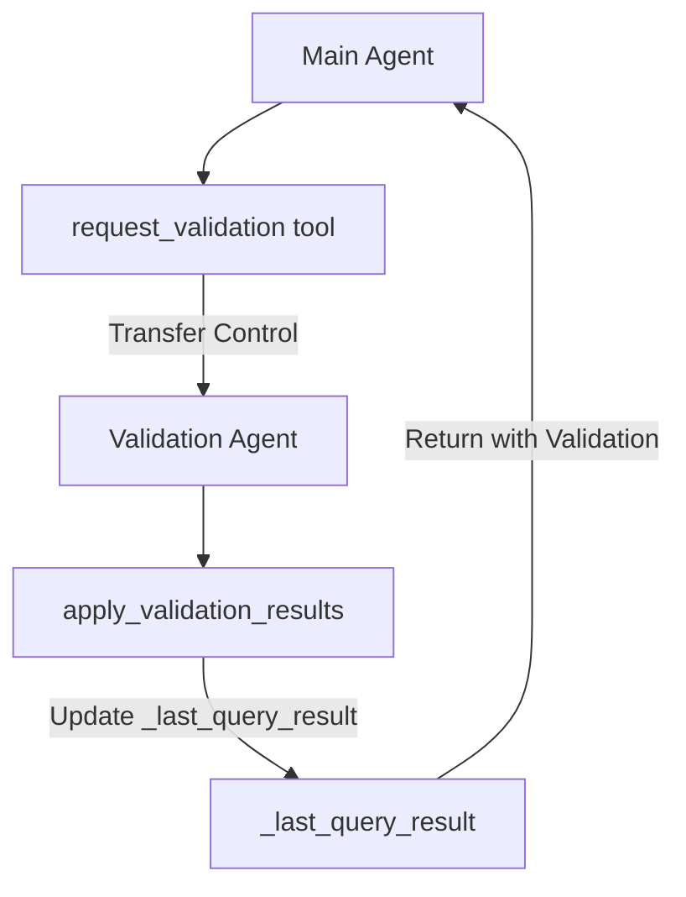

# Development Guide

This guide provides step-by-step instructions for extending the Data Insights Agent with new features.

## Table of Contents

**Backend**
1. [How to Add a BigQuery Tool](#how-to-add-a-bigquery-tool)
2. [How to Create a Sub-Agent](#how-to-create-a-sub-agent)
3. [How to Extend Enrichment](#how-to-extend-enrichment)

**Frontend**
4. [How to Add a Chart Type](#how-to-add-a-chart-type)
5. [State Management Patterns](#state-management-patterns)

---

# Backend Extension Guide

## How to Add a BigQuery Tool

Adding a new tool allows the agent to perform additional operations on BigQuery data. This guide walks through creating a hypothetical `get_table_row_count` tool.

### Step 1: Define the Tool Function

**Location**: `backend/agent/tools.py`

Add your tool function with proper type hints and docstring:

```python
def get_table_row_count(table_name: str) -> dict[str, Any]:
    """Get the approximate row count for a BigQuery table.

    This tool provides a quick estimate of table size without running
    a full COUNT(*) query, using BigQuery's table metadata.

    Args:
        table_name: The name of the table (can be just the table name or fully qualified)

    Returns:
        dict: A dictionary containing:
            - status: "success" or "error"
            - table_name: The table name
            - row_count: Approximate number of rows
            - last_modified: Timestamp of last modification

    Example:
        >>> get_table_row_count("states")
        {
            "status": "success",
            "table_name": "states",
            "row_count": 50,
            "last_modified": "2024-01-15T10:30:00Z"
        }
    """
    try:
        client = bigquery.Client(project=settings.google_cloud_project)

        # Handle both simple and fully qualified table names
        if "." not in table_name:
            full_table_id = f"{settings.google_cloud_project}.{settings.bigquery_dataset}.{table_name}"
        else:
            full_table_id = table_name

        table_ref = client.get_table(full_table_id)

        return {
            "status": "success",
            "table_name": table_name,
            "row_count": table_ref.num_rows,
            "last_modified": table_ref.modified.isoformat() if table_ref.modified else None
        }
    except Exception as e:
        return {
            "status": "error",
            "table_name": table_name,
            "error": str(e)
        }
```

**Key Requirements**:
- ✅ Include complete type hints (`-> dict[str, Any]`)
- ✅ Write comprehensive docstring with Args, Returns, Example
- ✅ Return a dictionary with `"status": "success"` or `"status": "error"`
- ✅ Handle errors gracefully with try/except
- ✅ Support both simple and fully qualified table names

### Step 2: Register the Tool

**Location**: `backend/agent/tools.py` (bottom of file)

Add your function to the `CUSTOM_TOOLS` list:

**Before**:
```python
CUSTOM_TOOLS = [
    get_available_tables,
    get_table_schema,
    validate_sql_query,
    execute_query_with_metadata,
    clear_schema_cache,
    add_calculated_column
]
```

**After**:
```python
CUSTOM_TOOLS = [
    get_available_tables,
    get_table_schema,
    get_table_row_count,  # ← New tool added here
    validate_sql_query,
    execute_query_with_metadata,
    clear_schema_cache,
    add_calculated_column
]
```

⚠️ **Important**: The order doesn't matter functionally, but grouping related tools (schema tools together, query tools together) improves code organization.

### Step 3: Update the Agent Prompt

**Location**: `backend/agent/prompts.py`

Add documentation for your tool in the `SYSTEM_INSTRUCTION` prompt:

**Before**:
```python
SYSTEM_INSTRUCTION = """You are a Data Insights Agent...

## CRITICAL: TOOL USAGE REQUIREMENTS

**YOU MUST USE TOOLS FOR ALL DATA OPERATIONS. NEVER make up or guess data.**

Available tools:
- `get_available_tables`: Use FIRST to see what tables exist in the dataset
- `get_table_schema`: Use to understand table structure before writing queries
- `execute_query_with_metadata`: USE THIS FOR ALL DATA QUERIES - it returns structured data
...
"""
```

**After**:
```python
SYSTEM_INSTRUCTION = """You are a Data Insights Agent...

## CRITICAL: TOOL USAGE REQUIREMENTS

**YOU MUST USE TOOLS FOR ALL DATA OPERATIONS. NEVER make up or guess data.**

Available tools:
- `get_available_tables`: Use FIRST to see what tables exist in the dataset
- `get_table_schema`: Use to understand table structure before writing queries
- `get_table_row_count`: Use to quickly check table size without running COUNT(*) queries  # ← New
- `execute_query_with_metadata`: USE THIS FOR ALL DATA QUERIES - it returns structured data
...
"""
```

**Prompt Best Practices**:
- ✅ Add a brief one-line description of when to use the tool
- ✅ Position it logically (schema-related tools together, query tools together)
- ✅ If the tool has specific use cases, add an example in the "WORKFLOW" section
- ✅ Test with queries that should trigger the tool to verify it's being called

### Step 4: Test the Tool

**Restart the backend**:
```bash
cd backend
python run.py
```

**Test query examples**:
1. "How many rows are in the states table?"
2. "What's the size of the locations table?"
3. "Check if the stores table is empty"

**Verify in logs**:
```
INFO:     Tool call: get_table_row_count(table_name="states")
INFO:     Tool result: {"status": "success", "row_count": 50, ...}
```

### Complete Example: Adding a `sample_table_data` Tool

**Full implementation**:

```python
# In backend/agent/tools.py

def sample_table_data(table_name: str, sample_size: int = 5) -> dict[str, Any]:
    """Get a random sample of rows from a BigQuery table.

    This tool retrieves a small random sample for quick data exploration
    without writing SQL queries. Useful for understanding data format.

    Args:
        table_name: The name of the table to sample
        sample_size: Number of random rows to return (default: 5, max: 20)

    Returns:
        dict: A dictionary containing:
            - status: "success" or "error"
            - table_name: The table name
            - sample_rows: List of row dictionaries
            - sample_size: Number of rows returned
    """
    try:
        # Limit sample size for safety
        sample_size = min(max(1, sample_size), 20)

        client = bigquery.Client(project=settings.google_cloud_project)

        if "." not in table_name:
            full_table_id = f"{settings.google_cloud_project}.{settings.bigquery_dataset}.{table_name}"
        else:
            full_table_id = table_name

        query = f"""
            SELECT *
            FROM `{full_table_id}`
            TABLESAMPLE SYSTEM (1 PERCENT)
            LIMIT {sample_size}
        """

        query_job = client.query(query)
        results = query_job.result()

        rows = [dict(row) for row in results]

        return {
            "status": "success",
            "table_name": table_name,
            "sample_rows": rows,
            "sample_size": len(rows)
        }
    except Exception as e:
        return {
            "status": "error",
            "table_name": table_name,
            "error": str(e)
        }

# Add to CUSTOM_TOOLS list
CUSTOM_TOOLS = [
    get_available_tables,
    get_table_schema,
    sample_table_data,  # ← New
    validate_sql_query,
    execute_query_with_metadata,
    clear_schema_cache,
    add_calculated_column
]
```

**Update prompt**:
```python
# In backend/agent/prompts.py

Available tools:
- `get_available_tables`: Use FIRST to see what tables exist in the dataset
- `get_table_schema`: Use to understand table structure before writing queries
- `sample_table_data`: Use to see example data rows (max 20) for quick exploration
- `execute_query_with_metadata`: USE THIS FOR ALL DATA QUERIES - it returns structured data
```

---

## How to Create a Sub-Agent

Sub-agents are specialized agents that handle specific tasks. This guide shows how to create a hypothetical "validation agent" that checks query results for data quality issues.

### Step 1: Create the Sub-Agent Package

**Directory structure**:
```
backend/agent/validation/
├── __init__.py
├── agent.py     # Agent definition
├── prompts.py   # Agent-specific prompts
└── tools.py     # Agent-specific tools (optional)
```

**Create `backend/agent/validation/__init__.py`**:
```python
"""Validation Sub-Agent - Checks query results for data quality issues."""

from .agent import create_validation_agent
from .tools import request_validation

__all__ = ['create_validation_agent', 'request_validation']
```

### Step 2: Define Agent-Specific Tools

**Create `backend/agent/validation/tools.py`**:
```python
"""Tools for the validation sub-agent."""

from typing import Any


def request_validation(
    row_count: int,
    column_count: int,
    check_types: list[str]
) -> dict[str, Any]:
    """Request validation of query results for data quality issues.

    This tool acts as a gatekeeper before transferring control to the
    validation_agent. It validates the request and decides if validation
    is appropriate.

    Args:
        row_count: Number of rows in the result set
        column_count: Number of columns to validate
        check_types: Types of checks to run (e.g., ["nulls", "duplicates", "outliers"])

    Returns:
        dict: Validation request result with status and agent_response

    Raises:
        ValueError: If validation parameters exceed limits
    """
    # Guardrails
    if row_count > 10000:
        raise ValueError("Validation only supported for result sets under 10,000 rows")

    if column_count > 20:
        raise ValueError("Cannot validate more than 20 columns at once")

    valid_checks = {"nulls", "duplicates", "outliers", "ranges"}
    if not all(check in valid_checks for check in check_types):
        raise ValueError(f"Invalid check types. Must be subset of {valid_checks}")

    # Transfer to validation_agent (implementation handled by ADK)
    return {
        "status": "validation_requested",
        "row_count": row_count,
        "column_count": column_count,
        "check_types": check_types,
        "message": "Transferring to validation agent..."
    }


def apply_validation_results(issues: list[dict[str, Any]]) -> dict[str, Any]:
    """Apply validation results to _last_query_result metadata.

    This tool is called by the validation_agent (not the main agent) to
    attach validation warnings to the query result.

    Args:
        issues: List of validation issues found

    Returns:
        dict: Updated result with validation metadata
    """
    from ..tools import _last_query_result

    if _last_query_result is None:
        return {
            "status": "error",
            "error": "No query result available to validate"
        }

    result = _last_query_result.copy()

    # Add validation metadata
    result["validation_metadata"] = {
        "issues": issues,
        "validated_at": __import__('datetime').datetime.now().isoformat(),
        "issue_count": len(issues)
    }

    return result
```

### Step 3: Create Agent-Specific Prompt

**Create `backend/agent/validation/prompts.py`**:
```python
"""System prompts for the validation sub-agent."""

VALIDATION_INSTRUCTION = """You are a Data Quality Validation Agent that checks query results for common issues.

Your role is to:
1. Analyze query results for data quality problems
2. Identify nulls, duplicates, outliers, and invalid ranges
3. Generate clear, actionable warnings
4. Call apply_validation_results with your findings

## Validation Workflow

When you receive a validation request:

1. **Analyze the data** from _last_query_result
2. **Run requested checks**:
   - "nulls": Check for unexpected NULL values
   - "duplicates": Identify duplicate rows or keys
   - "outliers": Flag statistical outliers (>3 std deviations)
   - "ranges": Validate values are in expected ranges
3. **Format issues** as structured objects
4. **Call apply_validation_results** with issue list

## Issue Format

Each issue should be a dict:
```python
{
    "column": "age",
    "issue_type": "outlier",
    "severity": "warning",  # "info", "warning", "error"
    "description": "Found 3 age values > 120 (possible data entry errors)",
    "affected_rows": 3,
    "example_values": [125, 130, 999]
}
```

## Example

User: (validation_agent receives control)
You: Analyze _last_query_result, identify issues, call apply_validation_results

## Constraints

- Do NOT modify the actual query results, only add metadata
- Do NOT re-run queries
- Flag issues but do NOT fix them automatically
- Provide specific examples in each issue description
"""
```

### Step 4: Create the Agent

**Create `backend/agent/validation/agent.py`**:
```python
"""Validation Sub-Agent - Checks query results for data quality issues."""

from google.adk.agents import Agent

from .prompts import VALIDATION_INSTRUCTION
from .tools import apply_validation_results


def create_validation_agent() -> Agent:
    """Create the validation sub-agent.

    This agent analyzes query results and identifies data quality issues
    like nulls, duplicates, outliers, and invalid ranges.

    Returns:
        Agent configured with validation capabilities
    """
    return Agent(
        name="validation_agent",
        model="gemini-2.0-flash-preview",
        description=(
            "A data quality specialist that analyzes query results for "
            "common issues (nulls, duplicates, outliers) and generates "
            "actionable warnings using apply_validation_results."
        ),
        instruction=VALIDATION_INSTRUCTION,
        tools=[apply_validation_results],
    )
```

### Step 5: Integrate with Main Agent

**Update `backend/agent/agent.py`**:

```python
from .enrichment import create_enrichment_agent, request_enrichment
from .validation import create_validation_agent, request_validation  # ← New

def create_agent() -> Agent:
    """Create and configure the Data Insights Agent with enrichment and validation."""

    # Create sub-agents
    enrichment_agent = create_enrichment_agent()
    validation_agent = create_validation_agent()  # ← New

    # Main agent with both sub-agents
    return Agent(
        name="data_insights_agent",
        model="gemini-2.0-flash-preview",
        description="A data insights agent that...",
        instruction=SYSTEM_INSTRUCTION,
        tools=CUSTOM_TOOLS + [request_enrichment, request_validation],  # ← Add request_validation
        sub_agents=[enrichment_agent, validation_agent],  # ← Add validation_agent
    )
```

**Update `backend/agent/tools.py`**:

```python
# Export request_validation from validation package
from .validation import request_validation  # ← At top of file

# Add to CUSTOM_TOOLS (for main agent)
CUSTOM_TOOLS = [
    get_available_tables,
    get_table_schema,
    validate_sql_query,
    execute_query_with_metadata,
    clear_schema_cache,
    add_calculated_column,
    request_validation  # ← New: Allows main agent to request validation
]
```

### Step 6: Update Main Agent Prompt

**Update `backend/agent/prompts.py`**:

```python
SYSTEM_INSTRUCTION = """...

Available tools:
- `get_available_tables`: Use FIRST to see what tables exist
- `get_table_schema`: Use to understand table structure
- `execute_query_with_metadata`: USE THIS FOR ALL DATA QUERIES
- `request_validation`: Use to check query results for data quality issues  # ← New
- `add_calculated_column`: Use to add derived calculations
...

## DATA QUALITY VALIDATION

After executing a query, you can request data quality validation:

**When to validate**:
- User asks for "data quality check" or "validation"
- Large result sets where quality issues are likely
- Data from unfamiliar or untrusted sources

**How to validate**:
Call `request_validation(row_count, column_count, check_types=["nulls", "duplicates", "outliers"])`

**Example**:
User: "Show me sales data and check for issues"
You:
1. Call execute_query_with_metadata(sql="SELECT * FROM sales LIMIT 1000")
2. Call request_validation(row_count=1000, column_count=5, check_types=["nulls", "outliers"])
3. The validation_agent will analyze results and return warnings

**Validation limits**:
- Max 10,000 rows
- Max 20 columns
- Valid check types: "nulls", "duplicates", "outliers", "ranges"
"""
```

### Sub-Agent Architecture Summary



**Key Patterns**:
1. **Request Tool**: Main agent calls `request_validation` (gatekeeper with guardrails)
2. **Control Transfer**: ADK automatically transfers to `validation_agent`
3. **Apply Tool**: Sub-agent calls `apply_validation_results` to modify shared state
4. **Return**: Control returns to main agent with updated data

---

## How to Extend Enrichment

This guide shows how to add new enrichment capabilities, such as enriching with financial data or weather information.

### Adding a New Enrichment Source

Currently, enrichment uses Google Search. To add a dedicated financial data API:

**Step 1: Add the API Client Tool**

**Create `backend/agent/enrichment/financial_tool.py`**:
```python
"""Financial data enrichment tool using Alpha Vantage API."""

import os
import requests
from typing import Any


def search_financial_data(
    symbols: list[str],
    fields: list[str]
) -> dict[str, Any]:
    """Fetch financial data for stock symbols.

    Args:
        symbols: List of stock ticker symbols (e.g., ["AAPL", "GOOGL"])
        fields: List of fields to fetch (e.g., ["price", "market_cap", "pe_ratio"])

    Returns:
        dict: Financial data keyed by symbol
    """
    api_key = os.getenv("ALPHA_VANTAGE_API_KEY")
    if not api_key:
        raise ValueError("ALPHA_VANTAGE_API_KEY not set")

    results = {}
    for symbol in symbols:
        # Example API call (simplified)
        url = f"https://www.alphavantage.co/query?function=OVERVIEW&symbol={symbol}&apikey={api_key}"
        response = requests.get(url, timeout=10)
        data = response.json()

        results[symbol] = {
            field: data.get(field.upper(), None)
            for field in fields
        }

    return results
```

**Step 2: Register with Enrichment Agent**

**Update `backend/agent/enrichment/agent.py`**:

```python
from google.adk.tools.google_search_tool import GoogleSearchTool
from .financial_tool import search_financial_data  # ← New

_google_search = GoogleSearchTool(bypass_multi_tools_limit=True)

def create_enrichment_agent() -> Agent:
    return Agent(
        name="enrichment_agent",
        model="gemini-2.0-flash-preview",
        description="Data enrichment specialist with Google Search and financial data APIs",
        instruction=ENRICHMENT_INSTRUCTION,
        tools=[_google_search, search_financial_data, apply_enrichment],  # ← Add financial tool
    )
```

**Step 3: Update Enrichment Prompt**

**Update `backend/agent/enrichment/prompts.py`**:

```python
ENRICHMENT_INSTRUCTION = """...

## Available Enrichment Sources

1. **Google Search** (`google_search`):
   - Use for: General information, geographic data, company info
   - Example: Searching for "population of California 2024"

2. **Financial Data** (`search_financial_data`):  # ← New
   - Use for: Stock prices, market cap, P/E ratios
   - Example: Fetching price for ["AAPL", "GOOGL"]
   - Fields: "price", "market_cap", "pe_ratio", "dividend_yield"

## Enrichment Workflow

When enriching financial data:
1. Identify unique stock symbols from source_column
2. Call search_financial_data(symbols, fields)
3. Format results for apply_enrichment
4. Call apply_enrichment to merge data

Example:
User request: "Enrich with stock prices"
Source column: "ticker" with values ["AAPL", "MSFT"]
You:
1. Call search_financial_data(symbols=["AAPL", "MSFT"], fields=["price", "market_cap"])
2. Format: [
     {"ticker": "AAPL", "enrichment": {"price": 178.25, "market_cap": "2.8T"}},
     {"ticker": "MSFT", "enrichment": {"price": 425.50, "market_cap": "3.1T"}}
   ]
3. Call apply_enrichment(source_column="ticker", enrichment_data=...)
"""
```

### Extending Enrichment Data Types

**Current**: Enrichment handles general text data
**Goal**: Add support for image URLs, coordinates, etc.

**Update `backend/agent/tools.py` in `apply_enrichment`**:

```python
def apply_enrichment(
    source_column: str,
    enrichment_data: list[dict[str, Any]],
    data_type: str = "general"  # ← Add data_type parameter
) -> dict[str, Any]:
    """Apply enrichment data to query results.

    Args:
        source_column: Column name to match enrichment data against
        enrichment_data: List of enrichment objects
        data_type: Type of enrichment ("general", "image", "coordinates", "financial")  # ← New
    """
    # ... existing validation code ...

    # Format enriched values based on data_type
    for row in result["rows"]:
        source_value = row.get(source_column)
        enrichment = enrichment_map.get(source_value)

        if enrichment:
            for field, value in enrichment.items():
                col_name = f"_enriched_{field}"

                # Different formatting based on data_type
                if data_type == "image":
                    row[col_name] = {
                        "value": value,  # Image URL
                        "type": "image",
                        "source": enrichment.get("_source", "Unknown"),
                        "alt_text": enrichment.get("alt_text", field)
                    }
                elif data_type == "coordinates":
                    row[col_name] = {
                        "value": value,  # [lat, lon]
                        "type": "coordinates",
                        "source": enrichment.get("_source", "Unknown"),
                        "formatted": f"{value[0]}, {value[1]}"
                    }
                else:  # "general" or "financial"
                    row[col_name] = {
                        "value": value,
                        "source": enrichment.get("_source", "Unknown"),
                        "confidence": enrichment.get("_confidence", "medium"),
                        "freshness": enrichment.get("_freshness"),
                        "warning": None
                    }

    # ... rest of function ...
```

---

# Frontend Extension Guide

## How to Add a Chart Type

This guide shows how to add a new chart type (e.g., "heatmap") to the application.

### Step 1: Update TypeScript Types

**Location**: `frontend/src/types/index.ts`

**Before**:
```typescript
export type ChartType = 'bar' | 'line' | 'pie' | 'scatter' | 'table';
```

**After**:
```typescript
export type ChartType = 'bar' | 'line' | 'pie' | 'scatter' | 'heatmap' | 'table';  // ← Add 'heatmap'
```

### Step 2: Add Chart Configuration Logic

**Location**: `frontend/src/hooks/useChartConfig.ts`

Add the configuration generator for your new chart type:

**Before** (at the end of `useChartConfig` hook):
```typescript
export function useChartConfig(options: UseChartConfigOptions): EChartsOption | null {
  return useMemo(() => {
    // ... existing code ...

    switch (chartType) {
      case 'bar':
        return generateBarChart(xColumn, yColumn, data);
      case 'line':
        return generateLineChart(xColumn, yColumn, data);
      case 'pie':
        return generatePieChart(xColumn, yColumn, data);
      case 'scatter':
        return generateScatterChart(xColumn, yColumn, data);
      default:
        return null;
    }
  }, [queryResult, chartType, xAxisColumn, yAxisColumn]);
}
```

**After**:
```typescript
export function useChartConfig(options: UseChartConfigOptions): EChartsOption | null {
  return useMemo(() => {
    // ... existing code ...

    switch (chartType) {
      case 'bar':
        return generateBarChart(xColumn, yColumn, data);
      case 'line':
        return generateLineChart(xColumn, yColumn, data);
      case 'pie':
        return generatePieChart(xColumn, yColumn, data);
      case 'scatter':
        return generateScatterChart(xColumn, yColumn, data);
      case 'heatmap':  // ← New
        return generateHeatmapChart(xColumn, yColumn, data);
      default:
        return null;
    }
  }, [queryResult, chartType, xAxisColumn, yAxisColumn]);
}
```

### Step 3: Implement the Chart Generator

**Location**: `frontend/src/hooks/useChartConfig.ts` (add helper function)

```typescript
/**
 * Generate ECharts configuration for heatmap visualization.
 *
 * @param xColumn - Column for x-axis categories
 * @param yColumn - Column for y-axis categories
 * @param data - Query result rows
 * @returns ECharts heatmap configuration
 *
 * @remarks
 * Heatmap requires:
 * - xColumn: First categorical dimension (e.g., "month")
 * - yColumn: Second categorical dimension (e.g., "product")
 * - Additional numeric column for heat values (auto-detected)
 *
 * Example data structure:
 * ```typescript
 * [
 *   { month: "Jan", product: "A", sales: 100 },
 *   { month: "Jan", product: "B", sales: 150 },
 *   { month: "Feb", product: "A", sales: 120 },
 *   ...
 * ]
 * ```
 */
function generateHeatmapChart(
  xColumn: ColumnInfo,
  yColumn: ColumnInfo,
  data: QueryResult
): EChartsOption {
  const rows = data.rows;

  // Find the numeric value column (exclude x and y columns)
  const numericColumns = data.columns.filter(
    col => isNumericColumn(col) && col.name !== xColumn.name && col.name !== yColumn.name
  );

  if (numericColumns.length === 0) {
    console.warn('No numeric column found for heatmap values');
    return {};
  }

  const valueColumn = numericColumns[0]; // Use first numeric column

  // Extract unique categories for x and y axes
  const xCategories = Array.from(new Set(rows.map(row => String(row[xColumn.name]))));
  const yCategories = Array.from(new Set(rows.map(row => String(row[yColumn.name]))));

  // Build heatmap data: [xIndex, yIndex, value]
  const heatmapData = rows.map(row => {
    const xIndex = xCategories.indexOf(String(row[xColumn.name]));
    const yIndex = yCategories.indexOf(String(row[yColumn.name]));
    const value = extractNumericValue(row[valueColumn.name]);
    return [xIndex, yIndex, value];
  });

  return {
    tooltip: {
      position: 'top',
      formatter: (params: any) => {
        const [xIdx, yIdx, val] = params.data;
        return `${xCategories[xIdx]}, ${yCategories[yIdx]}<br/>${valueColumn.name}: ${val}`;
      }
    },
    grid: {
      left: '10%',
      right: '10%',
      bottom: '15%',
      top: '10%',
      containLabel: true
    },
    xAxis: {
      type: 'category',
      data: xCategories,
      name: xColumn.name,
      splitArea: { show: true }
    },
    yAxis: {
      type: 'category',
      data: yCategories,
      name: yColumn.name,
      splitArea: { show: true }
    },
    visualMap: {
      min: Math.min(...heatmapData.map(d => d[2])),
      max: Math.max(...heatmapData.map(d => d[2])),
      calculable: true,
      orient: 'horizontal',
      left: 'center',
      bottom: '0%',
      inRange: {
        color: ['#e0f3f8', '#abd9e9', '#74add1', '#4575b4', '#313695']
      }
    },
    series: [
      {
        name: valueColumn.name,
        type: 'heatmap',
        data: heatmapData,
        label: {
          show: false
        },
        emphasis: {
          itemStyle: {
            shadowBlur: 10,
            shadowColor: 'rgba(0, 0, 0, 0.5)'
          }
        }
      }
    ]
  };
}
```

**Key Implementation Points**:
- ✅ Use `extractNumericValue()` to handle enriched/calculated values
- ✅ Provide clear tooltips with formatted data
- ✅ Add visual feedback (emphasis, shadows)
- ✅ Document expected data structure in JSDoc

### Step 4: Add UI Control

**Location**: `frontend/src/components/Results/ResultsPanel.tsx`

Update the chart type selector to include the new option:

**Find the chart type buttons** (around line 150):
```typescript
<div className="flex gap-2">
  <button
    onClick={() => setChartType('bar')}
    className={`px-3 py-1.5 text-sm rounded ${chartType === 'bar' ? 'bg-blue-500 text-white' : 'bg-gray-200'}`}
  >
    <BarChart3 className="w-4 h-4 inline mr-1" />
    Bar
  </button>
  <button
    onClick={() => setChartType('line')}
    className={`px-3 py-1.5 text-sm rounded ${chartType === 'line' ? 'bg-blue-500 text-white' : 'bg-gray-200'}`}
  >
    <LineChart className="w-4 h-4 inline mr-1" />
    Line
  </button>
  {/* ... other buttons ... */}
</div>
```

**Add the heatmap button**:
```typescript
import { BarChart3, LineChart, PieChart, ScatterChart, Grid3x3 } from 'lucide-react';  // ← Add Grid3x3

// ... in the button group ...
<button
  onClick={() => setChartType('heatmap')}
  className={`px-3 py-1.5 text-sm rounded ${chartType === 'heatmap' ? 'bg-blue-500 text-white' : 'bg-gray-200'}`}
>
  <Grid3x3 className="w-4 h-4 inline mr-1" />
  Heatmap
</button>
```

### Step 5: Test the New Chart Type

1. **Restart frontend**:
   ```bash
   cd frontend
   npm run dev
   ```

2. **Run a query** that returns data suitable for heatmaps:
   ```
   "Show me sales by month and product category"
   ```

3. **Click the "Heatmap" button** in the results panel

4. **Verify** the visualization renders correctly

### Complete Chart Type Checklist

When adding a new chart type, ensure:

- [ ] Type added to `ChartType` union in `types/index.ts`
- [ ] Case added to switch statement in `useChartConfig.ts`
- [ ] Chart generator function implemented with:
  - [ ] Proper data extraction using `extractNumericValue()`
  - [ ] Clear tooltips and labels
  - [ ] JSDoc documentation
  - [ ] Error handling for missing/invalid data
- [ ] UI button added to `ResultsPanel.tsx` with icon
- [ ] Tested with appropriate query data

---

## State Management Patterns

The Data Insights Agent uses **React hooks** for state management without external libraries like Redux. Understanding these patterns is essential for extending the frontend.

### Pattern 1: Custom Hooks for Feature Logic

**Location**: `frontend/src/hooks/`

Each major feature has a dedicated custom hook that encapsulates:
- State variables
- API calls
- Business logic
- Event handlers

**Example: `useChat` Hook**

```typescript
// frontend/src/hooks/useChat.ts

export function useChat() {
  // Local state
  const [messages, setMessages] = useState<ChatMessage[]>([]);
  const [isLoading, setIsLoading] = useState(false);
  const [sessionId, setSessionId] = useState<string>('');
  const [error, setError] = useState<string | null>(null);

  // Initialize session on mount
  useEffect(() => {
    const initSession = async () => {
      try {
        const session = await api.createSession();
        setSessionId(session.id);
      } catch (err) {
        setError('Failed to initialize session');
      }
    };
    initSession();
  }, []);

  // Event handler: Send message
  const sendMessage = useCallback(async (content: string) => {
    if (!sessionId || isLoading) return;

    // Optimistic update: Add user message immediately
    const userMessage: ChatMessage = {
      id: crypto.randomUUID(),
      role: 'user',
      content,
      timestamp: new Date().toISOString(),
    };
    setMessages(prev => [...prev, userMessage]);
    setIsLoading(true);

    try {
      // Call API
      const response = await api.sendMessage(sessionId, content);

      // Add assistant response
      setMessages(prev => [...prev, response.message]);
      setError(null);
    } catch (err) {
      setError('Failed to send message');
      // Rollback optimistic update
      setMessages(prev => prev.filter(m => m.id !== userMessage.id));
    } finally {
      setIsLoading(false);
    }
  }, [sessionId, isLoading]);

  return {
    messages,
    isLoading,
    sessionId,
    error,
    sendMessage,
  };
}
```

**Usage in Component**:
```typescript
function App() {
  const { messages, isLoading, sendMessage } = useChat();

  return (
    <ChatPanel
      messages={messages}
      isLoading={isLoading}
      onSendMessage={sendMessage}
    />
  );
}
```

**Key Patterns**:
- ✅ **Single Responsibility**: Each hook manages one feature
- ✅ **Encapsulation**: Internal state not exposed, only interface methods
- ✅ **Memoization**: Use `useCallback` for stable function references
- ✅ **Optimistic Updates**: Update UI immediately, rollback on error

### Pattern 2: Prop Drilling with Component Composition

**Problem**: Passing state through many component layers

**Solution**: Compose components logically to minimize prop drilling

**Good Example** (shallow hierarchy):
```typescript
<App>
  ├─ <ChatPanel>           // Direct child, receives chat state
  │   ├─ <MessageList>     // Receives messages array
  │   └─ <MessageInput>    // Receives sendMessage handler
  └─ <ResultsPanel>        // Separate panel, receives results state
      ├─ <DataTable>       // Receives rows
      └─ <ChartView>       // Receives chart config
</App>
```

**Bad Example** (deep nesting):
```typescript
<App>
  └─ <Layout>
      └─ <Sidebar>
          └─ <ChatContainer>
              └─ <ChatPanel>        // Props drilled through 4 layers!
                  └─ <MessageList>
```

**Best Practices**:
- Keep component hierarchy flat (max 3-4 levels)
- Co-locate related components (Chat components in one panel)
- Pass only required props (not entire state objects)

### Pattern 3: Derived State with `useMemo`

**Use Case**: Computing expensive values from state

**Example: Chart Configuration**

```typescript
// frontend/src/hooks/useChartConfig.ts

export function useChartConfig(options: UseChartConfigOptions): EChartsOption | null {
  const { queryResult, chartType, xAxisColumn, yAxisColumn } = options;

  // Memoize expensive chart configuration calculation
  return useMemo(() => {
    // Early return if data not ready
    if (!queryResult?.columns || !queryResult?.rows) {
      return null;
    }

    // Auto-detect columns if not specified
    const xColumn = xAxisColumn
      ? queryResult.columns.find(col => col.name === xAxisColumn)
      : queryResult.columns.find(col => !isNumericColumn(col));

    const yColumn = yAxisColumn
      ? queryResult.columns.find(col => col.name === yAxisColumn)
      : queryResult.columns.find(col => isNumericColumn(col));

    if (!xColumn || !yColumn) return null;

    // Generate chart config based on type
    switch (chartType) {
      case 'bar':
        return generateBarChart(xColumn, yColumn, queryResult);
      case 'line':
        return generateLineChart(xColumn, yColumn, queryResult);
      default:
        return null;
    }
  }, [queryResult, chartType, xAxisColumn, yAxisColumn]);
  // ↑ Only recompute when these dependencies change
}
```

**When to use `useMemo`**:
- ✅ Expensive calculations (chart configs, data transformations)
- ✅ Derived state that depends on props/state
- ✅ Preventing unnecessary re-renders of child components

**When NOT to use**:
- ❌ Simple value lookups or arithmetic
- ❌ Premature optimization (measure first!)

### Pattern 4: API Call with `useEffect`

**Use Case**: Fetch data on component mount or state change

**Example: Load Session Messages**

```typescript
function ChatHistory({ sessionId }: { sessionId: string }) {
  const [messages, setMessages] = useState<ChatMessage[]>([]);
  const [loading, setLoading] = useState(true);

  useEffect(() => {
    // Skip if no session ID
    if (!sessionId) return;

    let cancelled = false;  // Flag to prevent state updates after unmount

    const loadMessages = async () => {
      setLoading(true);
      try {
        const data = await api.getSessionMessages(sessionId);
        if (!cancelled) {
          setMessages(data);
        }
      } catch (err) {
        if (!cancelled) {
          console.error('Failed to load messages:', err);
          setMessages([]);
        }
      } finally {
        if (!cancelled) {
          setLoading(false);
        }
      }
    };

    loadMessages();

    // Cleanup function: prevent state updates if component unmounts
    return () => {
      cancelled = true;
    };
  }, [sessionId]);  // Re-run when sessionId changes

  if (loading) return <div>Loading...</div>;
  return <MessageList messages={messages} />;
}
```

**Key Points**:
- ✅ Use cleanup function to prevent memory leaks
- ✅ Guard against state updates after unmount
- ✅ Specify dependencies array correctly

### Pattern 5: Event Handlers with `useCallback`

**Problem**: Functions recreated on every render cause child re-renders

**Solution**: Memoize handlers with `useCallback`

**Example**:
```typescript
function MessageInput({ onSend, isLoading }: MessageInputProps) {
  const [input, setInput] = useState('');

  // Memoized submit handler (stable reference)
  const handleSubmit = useCallback(() => {
    if (!input.trim() || isLoading) return;
    onSend(input.trim());
    setInput('');
  }, [input, isLoading, onSend]);
  // ↑ Only recreate when dependencies change

  // Memoized keyboard handler
  const handleKeyDown = useCallback((e: KeyboardEvent<HTMLTextAreaElement>) => {
    if (e.key === 'Enter' && !e.shiftKey) {
      e.preventDefault();
      handleSubmit();
    }
  }, [handleSubmit]);

  return (
    <textarea
      value={input}
      onChange={(e) => setInput(e.target.value)}
      onKeyDown={handleKeyDown}
      disabled={isLoading}
    />
  );
}
```

**When to use `useCallback`**:
- ✅ Handlers passed to child components
- ✅ Dependencies in other hooks (`useEffect`, `useMemo`)
- ✅ Event listeners

### Pattern 6: Controlled Components

**All form inputs should be controlled** (state-driven, not DOM-driven):

```typescript
function SearchFilter() {
  const [query, setQuery] = useState('');
  const [category, setCategory] = useState('all');

  return (
    <>
      {/* Controlled text input */}
      <input
        type="text"
        value={query}  // ← Controlled by state
        onChange={(e) => setQuery(e.target.value)}
      />

      {/* Controlled select */}
      <select
        value={category}  // ← Controlled by state
        onChange={(e) => setCategory(e.target.value)}
      >
        <option value="all">All</option>
        <option value="active">Active</option>
      </select>
    </>
  );
}
```

**Benefits**:
- Single source of truth (state)
- Easy to validate and transform input
- Testable without DOM

### State Management Checklist

When adding new features:

- [ ] Create a custom hook for complex logic (`useFeatureName`)
- [ ] Use `useState` for local component state
- [ ] Use `useEffect` for side effects (API calls, subscriptions)
- [ ] Use `useMemo` for expensive derived state
- [ ] Use `useCallback` for memoized event handlers
- [ ] Keep component hierarchy flat (avoid deep nesting)
- [ ] Make all form inputs controlled components
- [ ] Add cleanup functions to `useEffect` when needed

---

## Testing Your Extensions

### Backend Testing

**Manual Testing**:
```bash
# 1. Start backend
cd backend
python run.py

# 2. Test tool directly in Python REPL
python
>>> from agent.tools import get_table_row_count
>>> result = get_table_row_count("states")
>>> print(result)

# 3. Test via API
curl -X POST http://localhost:8088/api/chat \
  -H "Content-Type: application/json" \
  -d '{"session_id": "test", "message": "How many rows in states table?"}'
```

**Check Logs**:
```
INFO:     Tool call: get_table_row_count(table_name="states")
INFO:     Tool result: {"status": "success", "row_count": 50}
```

### Frontend Testing

**Browser DevTools**:
1. Open browser console (F12)
2. Trigger your feature
3. Check console for errors
4. Inspect React components with React DevTools

**Manual Testing Steps**:
1. Run query that triggers new chart type
2. Click new chart button
3. Verify visualization renders
4. Check data tooltips
5. Test with edge cases (empty data, single row, etc.)

---

## Summary

This guide covered:

✅ **Backend**: Adding BigQuery tools, creating sub-agents, extending enrichment
✅ **Frontend**: Adding chart types, state management patterns
✅ **Best Practices**: Code examples, testing strategies, common pitfalls

For architecture details, see [`ARCHITECTURE.md`](./ARCHITECTURE.md).
For inline documentation, see source files (fully documented with JSDoc/docstrings).

---

*Last updated: February 2026*
